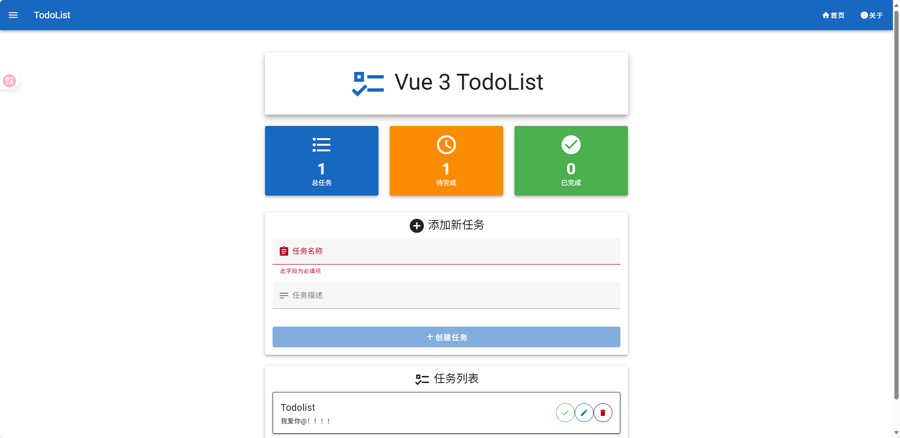

# Golang TodoList

一个基于 Go 后端和 Vue 3 前端的[待办事项](https://www.bilibili.com/video/BV1oUEozDEQa/)管理应用,适合学习全栈开发、Go Web 服务和现代前端架构。

## 项目结构

```
golang-todolist/
├── backend/      # Go 后端服务（Gin + GORM + MySQL）
│   ├── main.go
│   ├── config/
│   ├── db/
│   ├── handlers/
│   ├── middleware/
│   └── routes/
│
├── frontend/     # 前端项目（Vue 3 + Vite + Pinia + Vue Router）
│   ├── index.html
│   ├── package.json
│   ├── src/
│   │   ├── App.vue
│   │   ├── main.js
│   │   ├── components/
│   │   ├── views/
│   │   ├── store/
│   │   └── router/
│   └── ...
└── README.md
```

## 快速开始

### 后端启动

1. 进入 `backend` 目录：
   ```bash
   cd backend
   ```
2. 安装依赖并运行：
   ```bash
   go mod tidy
   go run main.go
   ```

### 前端启动

1. 进入 `frontend` 目录：
   ```bash
   cd frontend
   ```
2. 安装依赖（推荐使用 pnpm）：
   ```bash
   pnpm install
   ```
3. 启动开发服务器：
   ```bash
   pnpm dev
   ```
4. 打开浏览器访问 [http://localhost:3000](http://localhost:3000)

## 功能简介



- 添加、删除、修改、完成待办事项
- 前后端分离，RESTful API 通信
- 支持跨域访问
- 响应式界面，体验流畅
- 支持多端访问

## 技术栈

### 后端

- **[Go](https://go.dev/)**:
  - [**8小时转职Golang工程师**](https://www.bilibili.com/video/BV1gf4y1r79E) : 最屌的视频教程;
  - [刘丹冰Aceld](https://www.yuque.com/aceld): 大佬笔记,看就完了;
  - [Golang中文学习文档站](https://golang.halfiisland.com) : Go爱好者驱动的中文学习站;
  - [Go语言圣经（中文版）](https://gopl-zh.github.io/index.html) : 一本正经的Golang教科书;
- **Gin**:一个非常流行的Web框架。
  - [狂神说 Gin框架一小时上手](https://www.bilibili.com/video/BV1Rd4y1C7A1): 看完可直接上手;
- [**GORM**](https://gorm.io/zh_CN):Go中的`ORM`.
- [**GORM_GEN**](https://gorm.io/zh_CN/gen):GORM的脚手架,根据数据库快速搭建GROM的`CRUD`;
  - [gorm-gen教程](https://www.bilibili.com/video/BV1Yad5YCEnG) : 需要`GORM`基础;
- **MySQL**:使用[`docker`](./docker-compose.yml)安装

### 前端

- Vue3
- Vite
- Pinia
- Vue Router
- Axios
- pnpm

## 贡献方式

欢迎 PR 和 Issue！请遵循以下流程：

1. Fork 本仓库
2. 新建分支并提交更改
3. 发起 Pull Request

## License

AGPL-3.0
