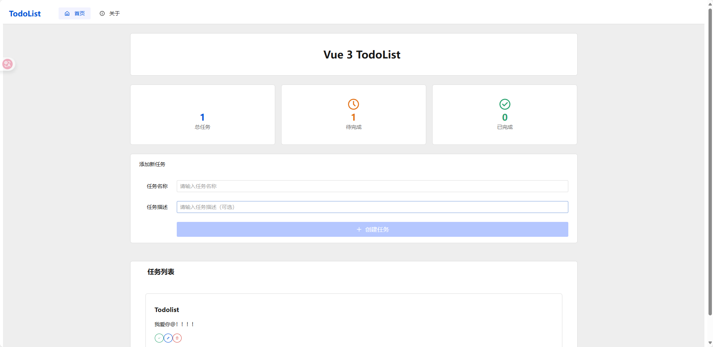

# Golang TodoList

一个基于 Go 后端和 Vue 3 前端的待办事项管理应用。适合学习全栈开发、Go Web 服务和现代前端架构。

## 项目结构

```
golang-todolist/
├── backend/      # Go 后端服务（Gin + GORM + MySQL）
│   ├── main.go
│   ├── config/
│   ├── db/
│   ├── handlers/
│   ├── middleware/
│   └── routes/
│
├── frontend/     # 前端项目（Vue 3 + Vite + Pinia + Vue Router）
│   ├── index.html
│   ├── package.json
│   ├── src/
│   │   ├── App.vue
│   │   ├── main.js
│   │   ├── components/
│   │   ├── views/
│   │   ├── store/
│   │   └── router/
│   └── ...
└── README.md
```

## 快速开始

### 后端启动

1. 进入 `backend` 目录：
   ```bash
   cd backend
   ```
2. 安装依赖并运行：
   ```bash
   go mod tidy
   go run main.go
   ```

### 前端启动

1. 进入 `frontend` 目录：
   ```bash
   cd frontend
   ```
2. 安装依赖（推荐使用 pnpm）：
   ```bash
   pnpm install
   ```
3. 启动开发服务器：
   ```bash
   pnpm dev
   ```
4. 打开浏览器访问 [http://localhost:3000](http://localhost:3000)

## 功能简介



- 添加、删除、修改、完成待办事项
- 前后端分离，RESTful API 通信
- 支持跨域访问
- 响应式界面，体验流畅
- 支持多端访问

## 技术栈

- 后端：Go、Gin、GORM、MySQL
- 前端：Vue 3、Vite、Pinia、Vue Router、Axios
- 包管理：pnpm

## 贡献方式

欢迎 PR 和 Issue！请遵循以下流程：

1. Fork 本仓库
2. 新建分支并提交更改
3. 发起 Pull Request

## License

AGPL-3.0
